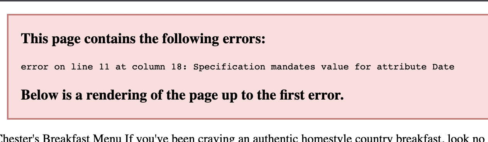
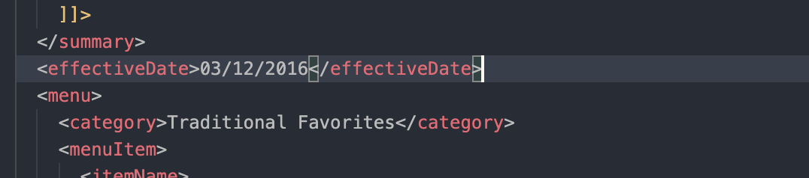
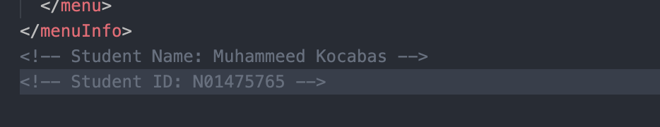
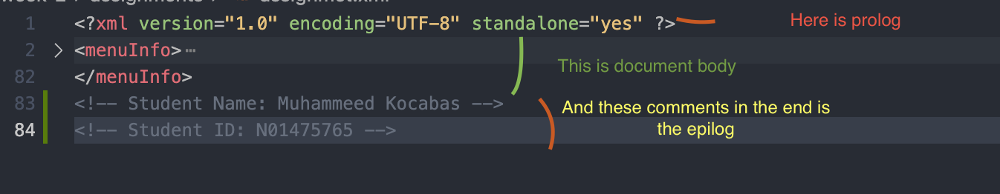
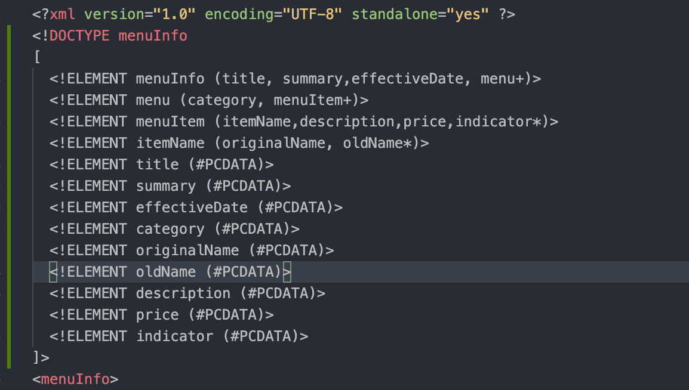
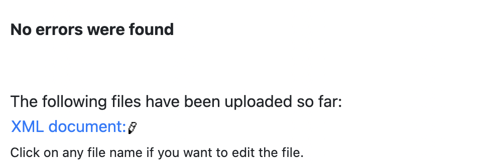
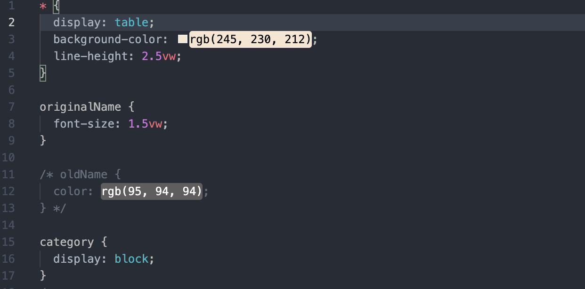
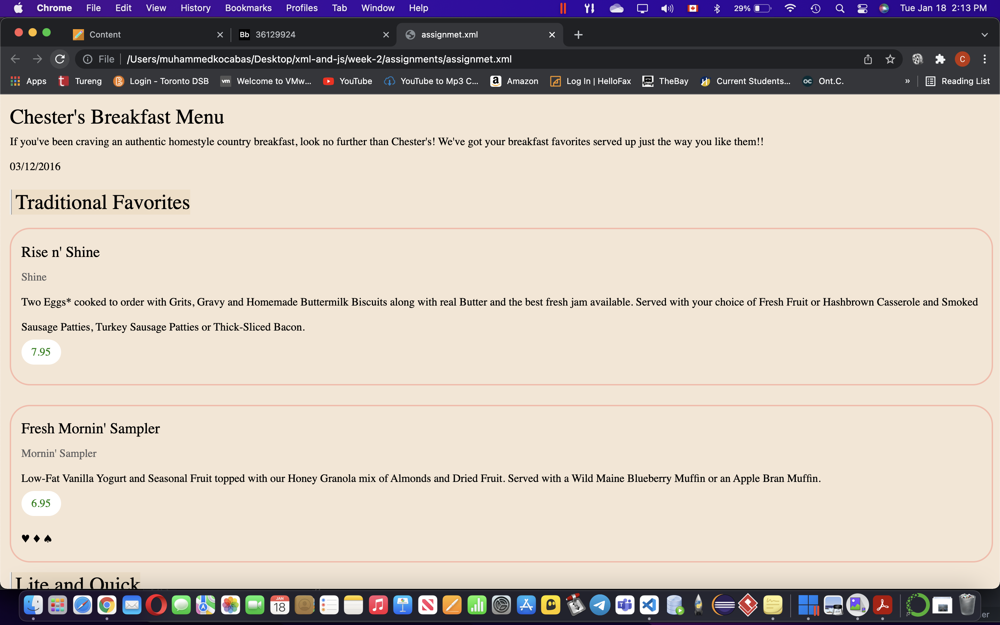

# Assignment 1

Student Name: Muhammed Kocabas Student ID: N01475765

1. Yes, when we open the file in browser it immediately prompts us that there is an error on line 11. When we navigate to this line, we can see that this tag is the problem: <effective Date> So we need to remove any spaces in these tags and it the error will be fixed.

Here is the fixed version:

2.We use CDATA in our element tags to declare the information that is passed within is strictly a string and will be treated as such. So we can use special characters such as <> & without any problems when we pass them in our CDATA blocks.

3. I have added my name to the end of the file.
   

4. Prolog is the XML declaration on the first line, everyting between <menuInfo> tags make up the document body and the comments we have added are the epilog part.
   

But no we do not have PIs yet, altough XML declaration looks like PI due to <? ?> tags, it is not processing instruction.

5. Here is the DTD for this document:
   

6. I have verified my document and there are no errors.
   

7. I have first completed the bare minimum for this ticket, then went on to add more style.

First: 

Final: 
