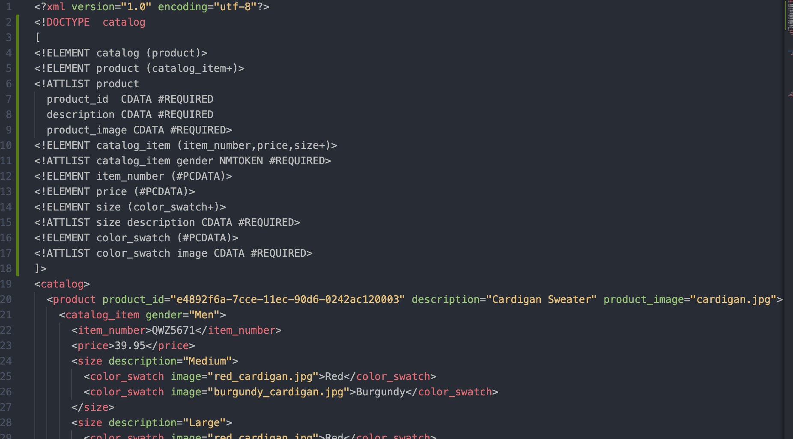
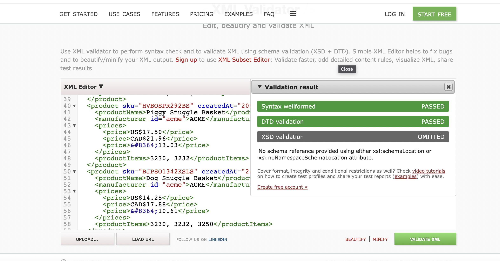
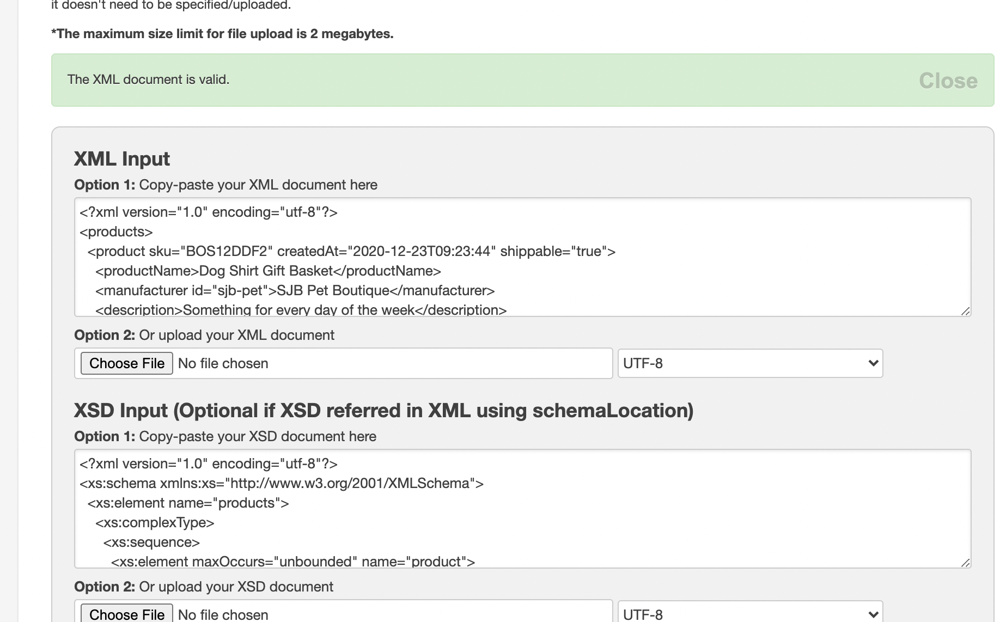

1.  

2.  

3.  

4.  I have read the documentation and DTD was so easy to build.
    However XSD took more time. I tried to keep it simple and start from outer branches and make my way all the way into the child elements.
