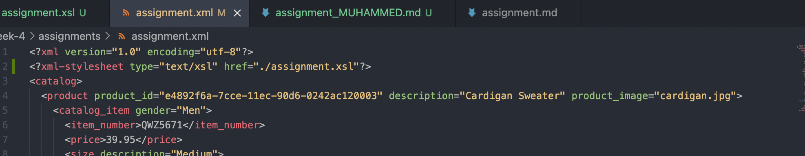

# Assignment

1 and 2. Here I have opened my XML file, created the XSL and linked it.

3.Creating this XSL file was quite tough. However as challenging as it is I had so much fun figuring it out. I mean incorporating all the styles and adding using operators based on attributes seriously taught me new things regarding XML-XSL.

